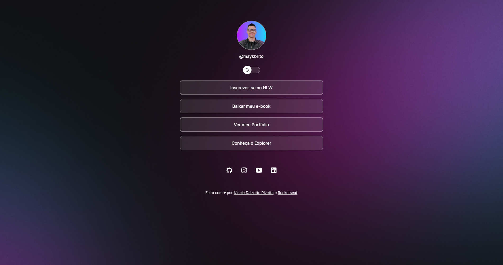
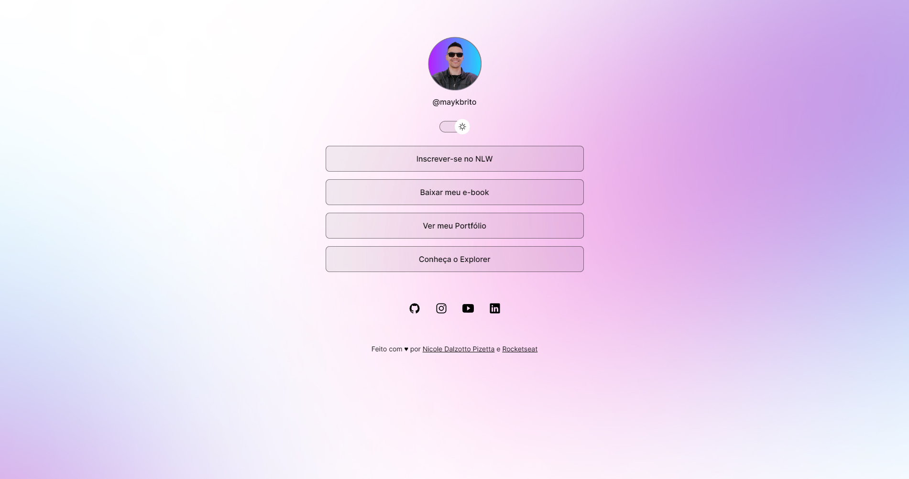
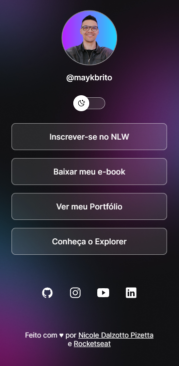
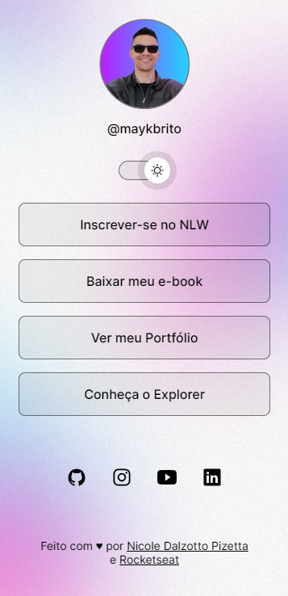

<h1 align="center"> DevLinks </h1>

Programa exclusivo e gratuito, promovido pela Rocketseat para ensino de tecnologias WEB.  
<a href="https://lp.rocketseat.com.br/devlinks/inscricao?utm_source=github&utm_medium=descricao&utm_campaign=capture-devlinks&utm_term=organic&utm_content=descricao-github-mayk-brito">Estude esse projeto em formato de vídeo clicando aqui.</a>

  

 

## 🚀 Tecnologias

Esse projeto foi desenvolvido com as seguintes tecnologias:

- HTML e CSS
- JavaScript
- Git e Github
- Figma
- Semantic HTML5 markup
- CSS custom properties
- CSS animations
- Flexbox

## 🚀 Preview site

O DevLinks é um agregador de links para usar como cartão de visitas online.

- [Clique aqui](https://nicoledpizetta.github.io/DevLinks/)

## 🚀 Screenshots

#### Desktop

#### Mobile

 

## 🚀 Recursos úteis

- [Assistir aulas](https://lp.rocketseat.com.br/devlinks/inscricao?utm_source=github&utm_medium=descricao&utm_campaign=capture-devlinks&utm_term=organic&utm_content=descricao-github-mayk-brito)

## 🚀 Layout

Você pode visualizar o layout do projeto através [DESSE LINK](https://www.figma.com/community/file/1187422022288947321). É necessário ter conta no [Figma](https://figma.com) para acessá-lo.

## :memo: Licença

Esse projeto está sob a licença MIT.

---

 Feito com ♥ por <a href="https://github.com/NicoleDPizetta">Nicole Dalzotto Pizetta</a> e <a href="https://www.rocketseat.com.br/">Rocketseat</a> :wave: 
 <a href="https://discord.gg/rocketseat">Participe da comunidade Rocketseat!</a> 

---
